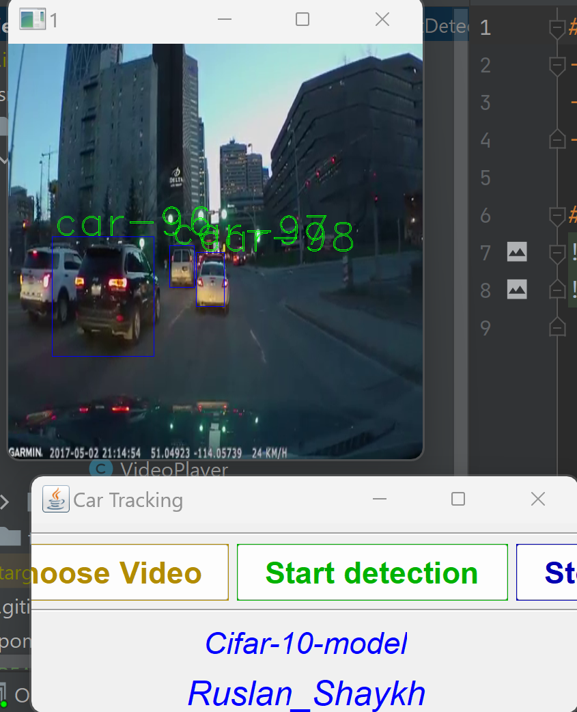

# Objects Detection
- Deep learning based on Neural Network  using YOLO and CifarModel;
- Made UI for uploading video and detecting in realtime;
- YOLO using for detected objects;
- Cifar model using for recognition objects (COCO classes);
- For UI used Swing;

# SCREENS

 
